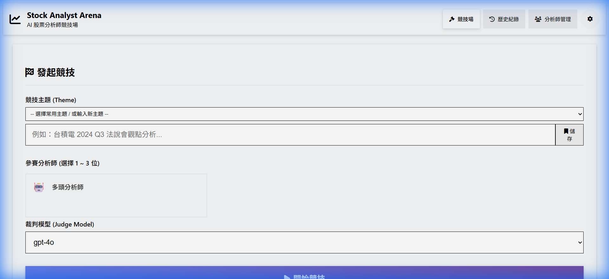
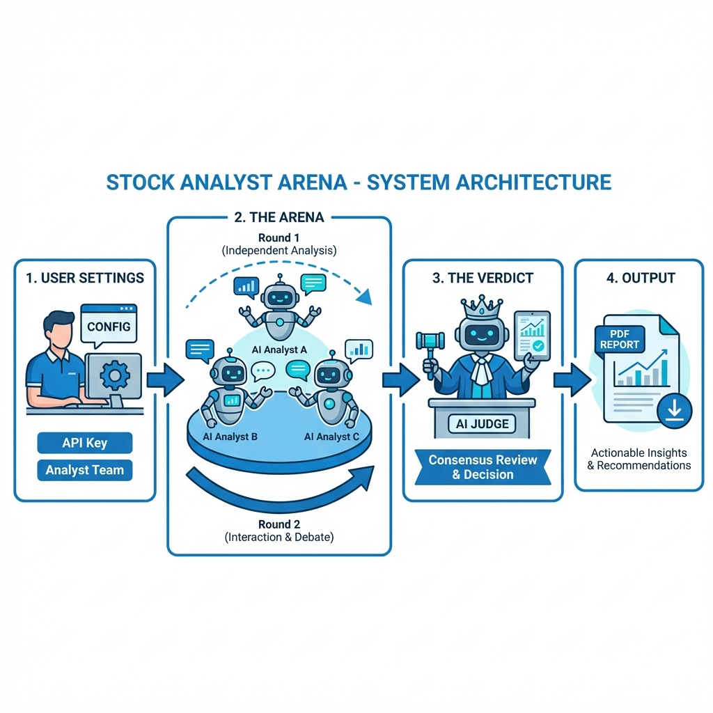
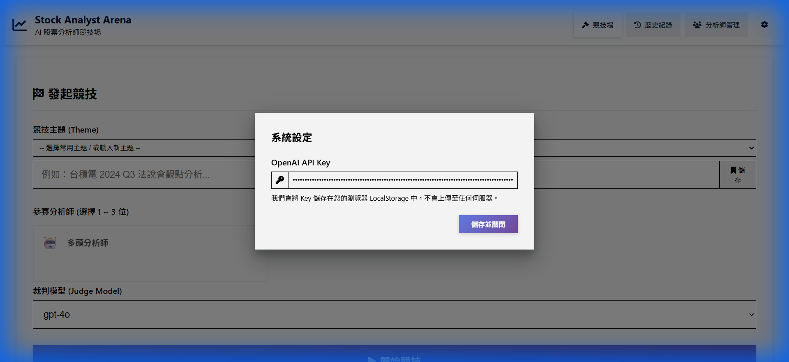
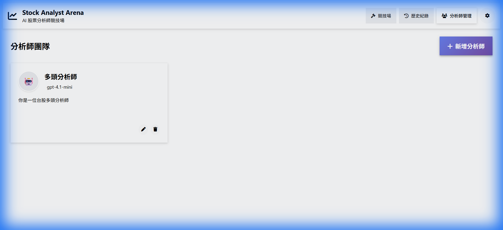
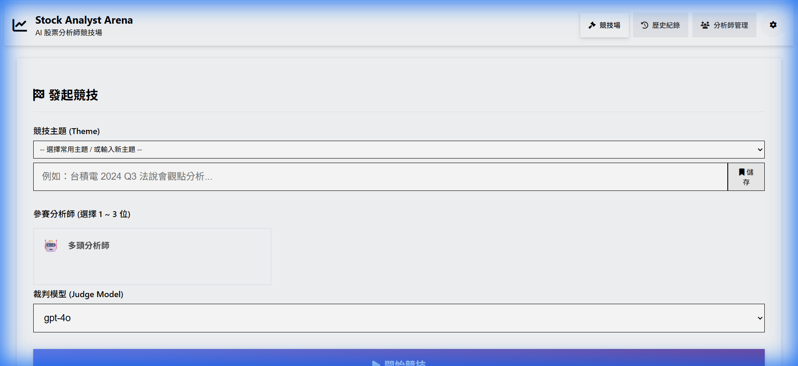

# Stock Analyst Arena | 股票分析師競技場

Stock Analyst Arena 是一個基於 AI 大語言模型的**多重觀點股票分析平台**。
透過模擬多位不同風格的 AI 分析師（如價值投資、技術分析、宏觀經濟專家）針對同一主題進行辯論與交互參考，最後由 AI 裁判給出綜合性的投資建議與風險評估。

### 系統架構圖 (System Architecture)

## 🌟 核心功能 (Key Features)

- **🤖 AI 分析師團隊 (AI Analyst Team)**

  - 您可以自由創建並客製化您的分析師團隊。
  - 為每位分析師設定獨特的「人設」與「分析風格」（System Prompt）。
  - 支援使用不同的 OpenAI 模型（如 gpt-4o, gpt-4o-mini 等）。

- **⚔️ 多輪競技辯論 (Arena Debate System)**

  - **第一輪 - 獨立觀點**：所有分析師在不互相干擾的情況下，針對主題發表初始看法。
  - **第二輪 - 交互參考**：分析師閱讀其他人的觀點後，進行修正、反駁或補充，形成更全面的見解。

- **⚖️ AI 裁判總結 (AI Verdict)**

  - 在激烈的討論後，由一位公正的 AI 裁判彙整所有資訊。
  - 產出結構化的最終報告，包含投資建議、衝突點分析與風險提示。

- **📄 歷史紀錄與 PDF 匯出**
  - 所有的競技過程都會自動儲存在瀏覽器中。
  - 支援將精美的分析報告匯出為 PDF 檔案，方便分享與保存。

---

## 🚀 快速開始 (Getting Started)

本專案是一個**純前端應用 (Pure Frontend Application)**，無需安裝任何後端伺服器，直接打開瀏覽器即可使用。

### 1. 啟動應用程式

直接雙擊打開專案目錄下的 `src/arena.html` 檔案，或將其拖曳至瀏覽器中。

### 2. 設定 API Key

首次使用時，請點擊右上角的 **設定圖示 (⚙️)**，輸入您的 OpenAI API Key。

- 這是使用 AI 功能的必要步驟。
- **隱私聲明**：您的 API Key 僅會儲存在您瀏覽器的 LocalStorage 中，**絕對不會**上傳至任何第三方伺服器。

---

## 📖 使用指南 (Usage Guide)

### 步驟 1：建立您的分析師團隊

點擊上方導航列的 **「分析師管理」**。
初始狀態下可能沒有分析師，請點擊 **「新增分析師」** 來擴充您的團隊。
您可以設定：

- **名稱**：例如「巴菲特風格 AI」、「技術線型大師」。
- **代表圖示**：選擇一個 Emoji 來代表他。
- **系統提示詞**：這是最重要的部分，定義了分析師的思考邏輯與專長。

### 步驟 2：發起競技

回到 **「競技場」** 首頁。

1.  **輸入競技主題**：例如「台積電 2024 Q3 法說會觀點」、「美元降息對金融股的影響」。
2.  **選擇參賽分析師**：勾選您希望參與討論的分析師（建議 2~3 位）。
3.  **選擇裁判模型**：建議使用能力較強的模型（如 gpt-4o）以獲得最佳總結品質。
4.  點擊 **「開始競技」**！

### 步驟 3：觀看分析過程

系統將自動執行：

1.  **獨立思考中...**：各分析師生成第一輪觀點。
2.  **交互參考中...**：分析師閱讀他人意見並更新看法。
3.  **裁判總結**：AI 裁判生成最終報告。

### 步驟 4：查看報告與匯出

競技結束後，您可以看到完整的討論串與裁判結論。
點擊下方的 **「生成 AI 報告」** 或 **「匯出 PDF 報告」** 按鈕來保存結果。

---

## ❓ 常見問題 (FAQ)

**Q: 為什麼點擊開始後沒有反應？**
A: 請檢查您的 API Key 是否正確設定，以及您的 OpenAI 帳戶是否有足夠的額度。

**Q: 我的資料會不見嗎？**
A: 所有資料（分析師設定、歷史紀錄）都儲存在您的瀏覽器資料庫 (IndexedDB) 中。只要不清除瀏覽器快取，資料都會保留。

**Q: 支援哪些模型？**
A: 支援 OpenAI 的 gpt-3.5-turbo, gpt-4o, gpt-4o-mini 等對話模型。系統會自動抓取您帳號可用的模型列表。

---

## Technical Stack

- **Frontend**: HTML5, Vue.js 3
- **Styling**: PrimeFlex, FontAwesome
- **Database**: IndexedDB (Browser Native)
- **AI Integration**: OpenAI API (Server-Sent Events)
- **PDF Generation**: html2pdf.js

---

Developed by Stock Analyst Arena Team.
